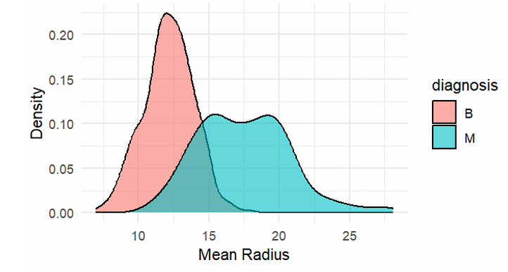
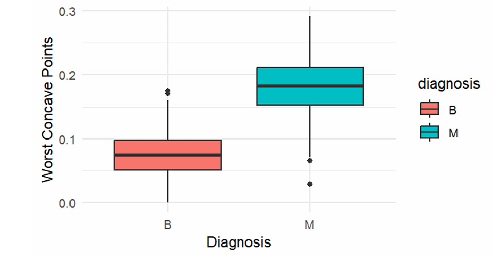
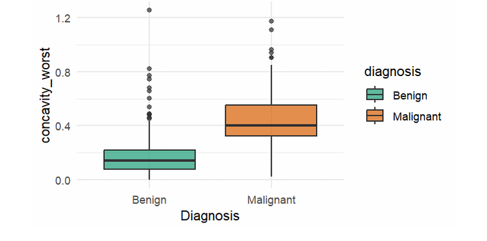
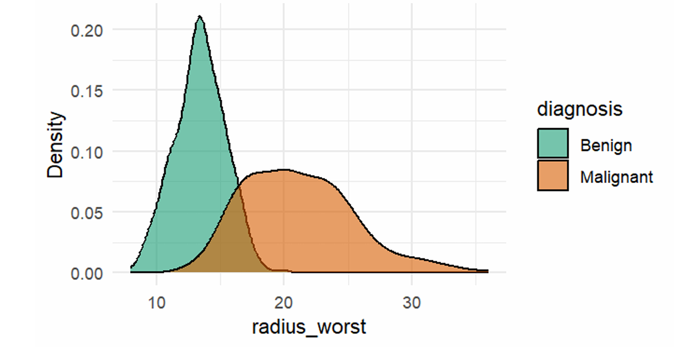
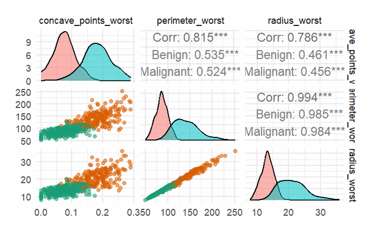
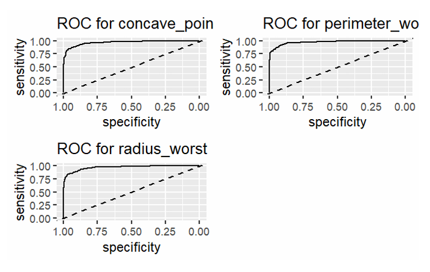
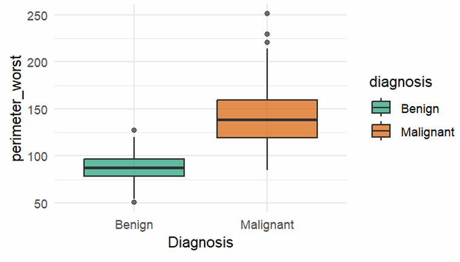
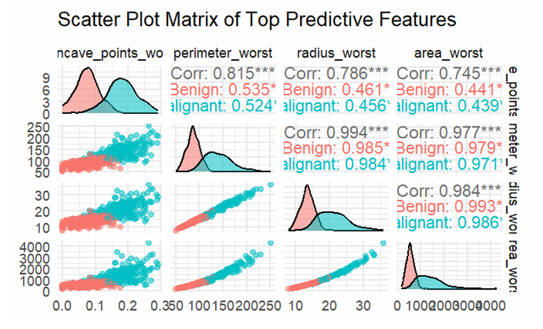

> **Quantitative Analysis of Diagnostic Features: Statistical Profiling of Nuclear Morphology in Breast Cancer using R**

## Executive Summary
This project leverages statistical programming in **R** to analyze the **Wisconsin Diagnostic Breast Cancer (WDBC)** dataset. By processing data from **568 patients**, we identified specific cellular irregularities that serve as strong predictors of cancer.

**Key Finding:** The number of severe concave contours (*concave_points_worst*) is the strongest single indicator of malignancy. Malignant tumors exhibit **145% higher irregularity** than benign cases (Effect Size: *d* = 2.69).

---

## Table of Contents
- Project Overview
- Key Insights & Findings
- Methodology
- Visualizations
- Repository Structure
- Contributors

---

## Project Overview
Diagnosis of breast cancer traditionally relies on subjective visual interpretation. This project aims to bridge the gap between raw data and clinical insight by achieving three goals:
1.  **Feature Identification:** Statistically isolate numerical features (e.g., *radius*, *concavity*) that correlate with malignancy.
2.  **Comparative Profiling:** Quantify differences between benign and malignant cases using rigorous hypothesis testing.
3.  **Visual Evidence:** Produce data-driven visualizations to communicate risk factors.

### The Dataset
We utilized the **Wisconsin Diagnostic Breast Cancer (WDBC)** dataset:
* **Sample Size:** 568 cases (357 Benign, 211 Malignant).
* **Features:** 32 features reduced to the **10 most salient "worst-case" metrics** (representing the most aggressive cell characteristics).

---

## Key Insights & Findings

| Feature | Clinical Observation | Statistical Impact |
| :--- | :--- | :--- |
| **Concave Points (Worst)** | Irregular shapes indicate aggression. | **+145%** higher in malignant cases. ($p < 1e^{-57}$) |
| **Perimeter (Worst)** | Outer boundary length correlates with stage. | **+62%** larger in malignant tumors. |
| **Radius (Worst)** | Larger nuclei suggest malignancy. | **+58%** larger (Mean: 21.12mm vs 13.38mm). |

> **Statistical Verification:** Bonferroni-corrected hypothesis testing confirmed that these differences are significant (all adjusted p-values < 1e-57). The effect size (*d* = -2.69) for concave points is considered **"Extremely Large"** in medical literature.

---

## Methodology
1.  **Data Cleaning:** Verified structure, checked for missing values (none found), and focused on "worst" mean values.
2.  **Exploratory Data Analysis (EDA):** Analyzed density curves and skewness. Identified that malignant tumors possess a right-skewed distribution for radius size.
3.  **Statistical Analysis:**
    * **Hypothesis Testing:** Wilcoxon rank-sum test & T-tests.
    * **Effect Size:** Cohen’s *d* calculation.
    * **Correlation:** Analyzed multicollinearity between size and texture features.
4.  **Verification:** Validated findings using ROC (Receiver Operating Characteristic) analysis.

---
## Visualizations

This section presents all key plots used in the analysis. Each figure highlights diagnostic differences between benign and malignant tumors using the WDBC dataset.

---

### Figure 1: Distribution of Mean Radius by Diagnosis  
  
> Malignant tumors have larger radius values with a right-skewed distribution.

---

### Figure 2: Boxplot of Concave Points Worst  
  
> Malignant tumors exhibit significantly more extreme concavities than benign.

---

### Figure 3: Nuclear Contour Irregularity  
  
> Malignant tumors concentrate at higher `concavity_worst` values with minimal overlap.

---

### Figure 4: Nuclear Size Distribution by Diagnosis  
  
> 58% larger modal radius in malignant samples compared to benign ones.

---
### Figure 5: Correlation Matrix of Top Predictive Features  
  
> Strong collinearity between size-related features and high diagnostic relevance of `concave_points_worst`.

---

### Figure 6: ROC Curve Analysis  
  
> ROC curves for top features show high AUC, confirming their predictive performance.

---

### Figure 6: Perimeter Distribution by Tumor Type  
  
> Malignant tumors show higher perimeter values with wider spread.

---

### Figure 8: Multivariate Feature Relationships  
  
> Top predictive features cluster distinctly by tumor type, enhancing classification clarity.


## Repository Structure

```
.
├── README.md
├── wdbc_analysis.R              # Main R script
├── wdbc.data                    # Dataset file
├── wdbc.names                   # Attribute names and description
├── Quantitative Analysis of Diagnostic Features_ Statistical Profiling of Nuclear Morphology in Breast Cancer using R.pdf
└── figures/
    ├── distribution_radius_worst.png
    ├── boxplot_concave_points_worst.png
    ├── feature_correlation_heatmap.png
    ├── scatter_matrix.png
    ├── roc_curves.png
    ├── distribution_perimeter_worst.png
    └── multivariate_relationships.png
```

## 👥 Contributors

| Name | GitHub |
| :--- | :--- |
| **Altagi Analyst** | [@AltagiAbdallah](https://github.com/AltagiAbdallah) |
| **Wejdan Salih** | [@wejdan-salih](https://github.com/wejdan-salih) |


## License

This project is for educational purposes under the Statistical Programming course (CCS2233) at Albukhary International University.
